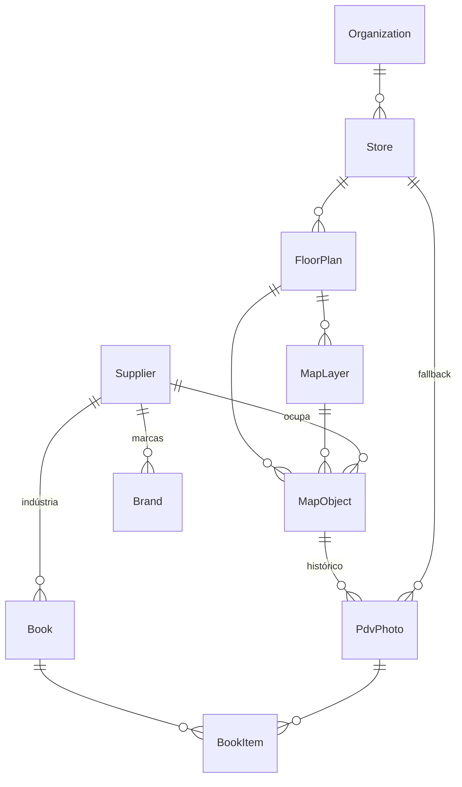

# Módulo Trade Marketing — Documentação e Handoff

> Documento vivo para continuar a implementação em outras sessões.
> Última atualização: entrega das etapas **M1–M4**.

---

## 1. Objetivo do módulo

Adicionar ao NERP (`erp-limas`) um módulo de **Trade Marketing** para a distribuidora
(a `Organization` da conta). Três partes conectadas:

1. **Editor de mapa da loja (planta baixa 2D)** — o usuário **desenha** paredes,
   corredores, gôndolas, ilhas, caixas, etc., **ou importa** uma planta como fundo.
   Cada objeto é independente. Arquitetado para **evoluir para 3D** sem reescrever dados.
2. **Fotos do PDV** — cada ponto promocional (objeto do mapa) acumula fotos por visita,
   formando histórico visual, com metadados e filtros.
3. **Book em PDF** — relatório fotográfico personalizado (capa + páginas) que puxa as
   fotos do PDV, para enviar à indústria (ex.: Nestlé).

### Decisões de arquitetura já tomadas (aprovadas)
- **Motor do editor 2D:** React-Konva (integração React; Transformer para
  arrastar/redimensionar/rotacionar; caminho coerente para React Three Fiber no 3D).
- **Planta baixa:** desenhar do zero **e** importar imagem/PDF como fundo (com escala em metros).
- **Fotos ↔ mapa:** anexadas ao **objeto do mapa** (gôndola/ilha), com **fallback** direto na loja quando ainda não há mapa.
- **PDF:** geração **server-side** (`@react-pdf/renderer`) como job Inngest, salvo em R2.
- **Indústria/Marcas:** reutilizar `Supplier` como "Indústria" (já tem `logo`) + tabela `Brand` (marcas com logo).

---

## 2. Stack (contexto do repo)

- Next.js 15 (App Router) · React 19.1 · TypeScript · Tailwind v4 + shadcn/ui
- Prisma 7 / PostgreSQL · client gerado em `src/generated/prisma` (importe de `@/generated/prisma/client` e enums de `@/generated/prisma/enums`)
- API via **oRPC** (`src/app/router/**`, client em `src/lib/orpc.ts`) + **TanStack Query**
- **Better Auth** com plugin de organização (multi-tenant via `Organization`/`Member`)
- **Zustand** (estado do editor) · **Cloudflare R2** (uploads via presigned URL)
- Lint/format: **Biome** (`pnpm biome check` / `--write`)
- Jobs em background: **Inngest** (`pnpm inngest:dev`)

> ⚠️ **Isolamento multi-tenant é feito na aplicação (não há RLS no Postgres).**
> Todo handler novo DEVE filtrar por `context.org.id`.

---

## 3. Modelo de dados (Prisma)

Adicionados em `prisma/schema.prisma` (todos org-scoped: `organizationId` + relação cascade + `@@index` + `@@map`).

| Model | Papel |
|---|---|
| `Store` | Loja / Cliente-PDV (`name`, `code`, `managerName` = Gerente da loja, endereço) |
| `FloorPlan` | Planta/mapa de uma loja (`widthM`, `heightM`, `pixelsPerMeter`, `backgroundImageKey`, `backgroundTransform`, `defaultViewport`) |
| `MapLayer` | Camada (Estrutura, Gôndolas, Promoções, Empresas, Elétrica, Hidráulica, Auditorias) — `visible`, `locked`, `order` |
| `MapObject` | Objeto do mapa (gôndola/parede/etc.). **`geometry` em metros**, `heightM` p/ 3D futuro, `style`, `supplierId`, `brandId`, painel lateral (`name/status/category/responsibleName/lastVisitAt/properties`) |
| `Brand` | Marca da indústria (`supplierId`, `name`, `logo`) → logos no Book |
| `PdvPhoto` | Foto/visita do PDV (`storeId`, `mapObjectId?`, `section`, `responsibleCompany`, `coordinatorName`, `consultantName`, `code`, `photos String[]`, `capturedAt`) |
| `Book` | Book (`supplierId`=Indústria, `distributorLogo`, `periodMonth/Year`, `status`, `pdfKey`, `generatedAt`) |
| `BookItem` | Junção Book ↔ PdvPhoto (`order`) |
| `MapAnnotation` | Pin/comentário/alerta/pendência (extra, ainda não usado na UI) |

Enums: `MapObjectType` (WALL, AISLE, SECTOR, GONDOLA, ISLAND, CHECKOUT, ENTRANCE, EXIT, DEPOSIT, RESTRICTED_AREA, PIN, TEXT), `MapShapeKind` (RECT, POLYGON, POLYLINE, POINT), `MapAnnotationType`, `BookStatus` (DRAFT|GENERATING|READY|FAILED).

Relações adicionadas em `Organization`, `Supplier` (atua como Indústria) e `User`.

### Diagrama


### ⚠️ Migração pendente
A migração **ainda não foi gerada/aplicada** (Postgres local indisponível no ambiente).
Com o banco de pé (porta `5435` conforme `.env` `DATABASE_URL`):
```bash
pnpm db:migrate --name add_trade_marketing_module
```
Enquanto não rodar, as rotas novas quebram em runtime (schema divergente).

---

## 4. Arquitetura do editor (engine-agnóstico → 3D)

Princípio: **o domínio (dados em metros) é independente do motor gráfico.**

- **Domínio:** models Prisma + tipos em `src/features/store-map/engine/types.ts` (`SceneObject`, `Geometry`, `SceneLayer`, `FloorPlanMeta`, `Viewport`).
- **Aplicação:** `engine/scene-store.ts` — store **Zustand** com objetos/camadas/seleção/viewport, **undo/redo**, e **fila de persistência** (`dirtyIds`/`newIds`/`deletedIds` → `consumeDirty()`).
- **Render:** `renderers/konva/` (2D atual). Um futuro `renderers/three/` consome o **mesmo** `SceneModel`/`geometry` e extruda por `heightM`.

Coordenadas: geometria em **metros**; o Stage do Konva usa `scale = zoom * pixelsPerMeter` e `x/y = viewport`, então os shapes são desenhados direto em metros (`strokeScaleEnabled=false` mantém traço em px).

Persistência: edições marcam objetos "sujos" → autosave **debounced (800ms)** via `mapObject.bulkUpsert`/`bulkDelete` (hook `use-floor-plan-scene.ts`). Ids gerados no cliente (uuid) para upsert idempotente.

---

## 5. API (oRPC) — routers novos

Registrados em `src/app/router/index.ts`. Todos escopados por `context.org.id`.

- `store/` — `create`, `list`, `getOne`, `update`, `delete`
- `brand/` — `create`, `list` (por `supplierId`), `update`, `delete`
- `floorPlan/` — `create` (cria camadas padrão), `list`, `getFull` (hidrata o editor), `update`, `delete`
- `mapLayer/` — `create`, `update`, `delete`, `reorder`
- `mapObject/` — `bulkUpsert`, `bulkDelete`
  - `bulkUpsert` só faz `update` de ids já pertencentes ao mapa (evita sobrescrever id de outra org); valida `layerId`.

---

## 6. Estrutura de pastas (o que já existe)

```
src/app/router/{store,brand,floor-plan,map-layer,map-object}/   # oRPC
src/app/(main)/(rest)/lojas/page.tsx                            # lista de lojas
src/app/(main)/(rest)/lojas/[storeId]/mapa/page.tsx             # editor
src/features/stores/            # CRUD de lojas (hooks + componentes)
src/features/brands/            # marcas (hook + BrandsManager embutido no fornecedor)
src/features/store-map/
  engine/        types.ts | geometry.ts | scene-store.ts | tools.ts
  hooks/         use-floor-plans.ts | use-map-layers.ts | use-floor-plan-scene.ts
  renderers/konva/  map-stage.tsx | shape-node.tsx | map-grid.tsx | map-background.tsx
  components/    map-editor.tsx | editor-toolbar.tsx | layers-panel.tsx
                 object-properties-panel.tsx | store-map-workspace.tsx | new-floor-plan-dialog.tsx
```

Permissões: chaves `lojas` e `books` em `src/lib/permissions.ts` + itens no `src/components/app-sidebar.tsx`.
Deps adicionadas: `konva@9`, `react-konva@19.0.10`, `use-image` (fixadas para React 19.1).

---

## 7. Status por etapa (roadmap)

| Etapa | Descrição | Status |
|---|---|---|
| **M1** | Schema + enums + permissões + sidebar + `prisma generate` | ✅ código pronto · ⚠️ **migração pendente** |
| **M2** | Store + Brand (routers, hooks, UI, BrandsManager) | ✅ completo |
| **M3** | Engine (types, geometry, scene-store) + routers floorPlan/mapLayer/mapObject | ✅ completo |
| **M4** | Editor React-Konva (zoom/pan, grid, snap, desenhar, Transformer, multi-seleção, camadas, autosave, painel básico) | ✅ completo |
| **M5** | Import de planta (imagem de fundo) + **calibração de escala** (2 cliques → medida real reescala o `backgroundTransform`) + opacidade + leitura de coordenadas em metros | ✅ completo (régua com ticks fica p/ M9) |
| **M6** | Painel lateral: vincular **Indústria (Supplier)** e **Marca (Brand)** + seção **Fotos do PDV** | ✅ completo |
| **M7** | **Fotos do PDV**: `MultiPhotoUploader`, router `pdvPhoto/` (create/list filtrado/update/delete/`filterOptions`), histórico por objeto, página `/lojas/[storeId]` (fallback na loja) | ✅ completo |
| **M8** | **Book em PDF** server-side: router `book/` (create/list/getOne/update/`importPhotos`/`removeItem`/`reorderItems`/`generate`), `@react-pdf/renderer`, `uploadBufferToR2`, função Inngest `book/generate`, polling/download; rota `/books` | ⏳ pendente |
| **M9** | Extras: minimapa, snapping/guias, culling de viewport, anotações (`MapAnnotation`), dashboard (contagens), refinos | ⏳ pendente |

---

## 8. Próximos passos detalhados (para retomar)

> **M5–M7 concluídos.** Próximo: **M8 (Book em PDF)**, depois **M9 (extras)**.
>
> Feito no editor: `background-controls.tsx`, `scale-calibration-dialog.tsx`, overlays de coordenadas/calibração
> (`map-stage.tsx`); painel com Indústria/Marca (`object-properties-panel.tsx`).
> Fotos do PDV em `src/features/pdv-photos/` (`multi-photo-uploader`, `pdv-photo-dialog`, `pdv-photo-history`,
> `pdv-photo-section`, hook `use-pdv-photos`) + router `src/app/router/pdv-photo/` + página `/lojas/[storeId]`.
> Helper compartilhado de upload: `src/lib/upload-to-r2.ts`.

### M8 — Book em PDF (server-side)
- Dep `@react-pdf/renderer`. Template `src/features/books/pdf/book-document.tsx` (capa: logo distribuidora=`Organization.logo` + logo indústria=`Supplier.logo` + nome + mês/ano; páginas: metadados + fotos + logos de marcas).
- Util server `uploadBufferToR2(key, buffer, contentType)` (o `/api/s3/upload` atual é presigned p/ cliente).
- Função Inngest `book/generate` (registrar em `src/app/api/inngest`): seta `GENERATING` → renderiza → upload R2 → grava `pdfKey/generatedAt/status=READY`.
- UI `/books` + `ImportPhotosDialog` (filtros) + polling de `getOne` + download (`constructUrl(pdfKey)`).

---

## 9. Convenções (padrão em todas as etapas)

- **Tipagem estrita — proibido `any`** (usar tipos gerados do Prisma, `z.infer`, tipos do `SceneModel`).
- **Código limpo e legível, sem comentários supérfluos** (comentar só o "porquê" não óbvio).
- **Reuso**: aproveitar uploaders existentes, `constructUrl` (`src/hooks/use-construct-url.ts`), padrão de hooks de `src/features/supplier/hooks/use-supplier.ts`, primitivos shadcn/ui.
- **Multi-tenant**: todo handler filtra por `context.org.id`.
- Rodar `pnpm biome check --write` nos arquivos novos e `npx tsc --noEmit` antes de fechar cada etapa.

---

## 10. Como rodar / verificar

```bash
# 1. Subir o Postgres (porta 5435 conforme .env) e aplicar a migração
pnpm db:migrate --name add_trade_marketing_module

# 2. App + Inngest (necessário para M8)
pnpm dev
pnpm inngest:dev

# 3. Fluxo de teste (após M5+):
#  - Criar Loja em /lojas → abrir Mapa → importar planta + calibrar escala
#  - Desenhar gôndolas/ilhas; arrastar/redimensionar/rotacionar; alternar camadas; recarregar (persistiu?)
#  - Clicar na gôndola → vincular Indústria+Marca, subir Fotos do PDV
#  - Criar Book (indústria + mês/ano) → Importar fotos (filtros) → Gerar → baixar PDF
```

---

## 11. Pendências / notas conhecidas

- **Migração do Prisma não aplicada** (ver §3). Sem isso as rotas novas quebram.
- **Verificação end-to-end ainda não exercida** (dependia do banco de pé).
- **Bug pré-existente (fora do escopo):** `src/app/router/supplier/update.ts` e `delete.ts` não escopam por organização (vazamento cross-tenant). Registrado à parte; os handlers novos deste módulo escopam corretamente.
- Git `origin` foi trocado para HTTPS nesta máquina (SSH indisponível). Para voltar: `git remote set-url origin git@github.com:ElFabrica/nerp-2.git`.
- PR aberta: **#8** — `feat/trade-marketing-map-pdv-book`.
